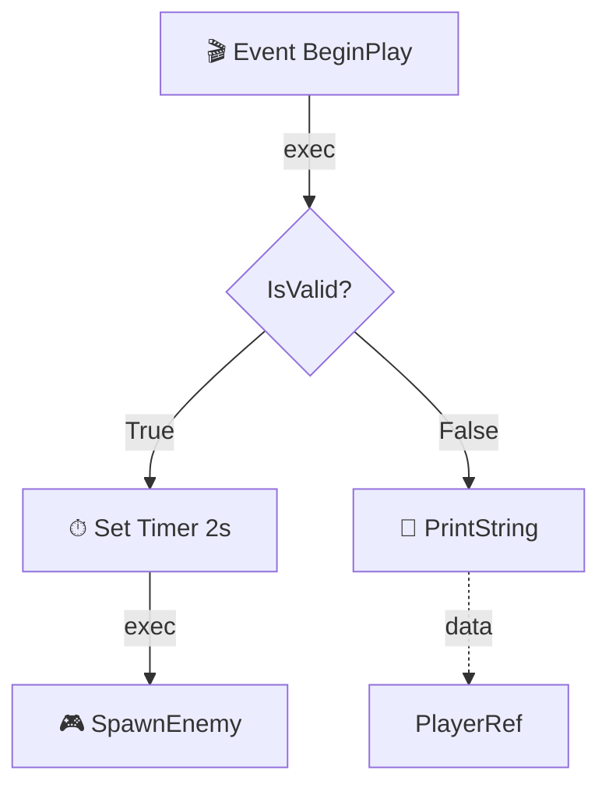

# 开发计划

## 项目概览

| 项 | 值 |
|---|---|
| 项目名 | blueprint-graph-reader |
| 目标 | UE 蓝图图结构 → JSON → Agent 可读格式 |
| 核心交付物 | C++ 插件 + Python 提取/转换脚本 |
| 预估工时 | 7-10 天 |

---

## Phase 1：C++ 插件 BlueprintGraphReader

**目标**：暴露蓝图图结构读取接口到 Python

**工期**：2 天

### 任务清单

- [ ] 1.1 创建 UE 插件项目结构
  - `BlueprintGraphReader.Build.cs`：模块依赖 Engine, BlueprintGraph, UnrealEd, Json
  - `BlueprintGraphReader.h`：接口声明
  - `BlueprintGraphReader.cpp`：实现

- [ ] 1.2 实现核心读取函数
  - `ExtractBlueprintAsJson(UBlueprint*)`：一步提取整个蓝图为 JSON 字符串
  - `GetBlueprintGraphNames(UBlueprint*)`：获取所有图名
  - `GetGraphNodes(UEdGraph*)`：获取节点列表
  - `GetNodePinInfo(UEdGraphNode*)`：获取 Pin 信息
  - `GetNodeSemanticInfo(UEdGraphNode*)`：获取节点语义
  - `GetBlueprintVariables(UBlueprint*)`：获取变量列表

- [ ] 1.3 实现图序列化
  - `SerializeGraph(UEdGraph*)`：将单个 EdGraph 序列化为 FJsonObject
  - `SerializeNode(UEdGraphNode*)`：将单个节点序列化
  - `SerializePin(UEdGraphPin*)`：将单个 Pin 序列化
  - 处理 K2Node 子类名提取（`Node->GetClass()->GetName()`）
  - 处理 Pin 连接关系（`Pin->LinkedTo` 数组遍历）

- [ ] 1.4 编译测试
  - 在 UE 5.4/5.5 编辑器中加载插件
  - 在 Python 控制台验证所有接口可调用
  - 在 2-3 个不同类型蓝图上测试（Actor BP、Widget BP、Anim BP）

### 技术要点

```
K2Node 子类名提取:
  Node->GetClass()->GetName()
  → 返回 "K2Node_Event", "K2Node_CallFunction" 等

Pin 连接遍历:
  for (UEdGraphPin* LinkedPin : Pin->LinkedTo)
  {
      UEdGraphNode* TargetNode = LinkedPin->GetOwningNode();
      // 记录 from_pin_id → to_pin_id
  }

Pin 方向:
  Pin->Direction == EGPD_Input  → input
  Pin->Direction == EGPD_Output → output

Pin 类型:
  Pin->PinType.PinCategory → "exec", "bool", "float", "int", "object", "struct", "string" 等
  Pin->PinType.PinSubCategoryObject → 具体类型 (如 Actor 类)
```

### 交付物

- `Source/BlueprintGraphReader/` 目录下完整的 C++ 插件源码
- 插件可在 UE Editor 中加载并正常工作

---

## Phase 2：Python 提取脚本

**目标**：Python 端一键提取蓝图为 JSON 文件

**工期**：1 天

### 任务清单

- [ ] 2.1 实现 `extract_blueprint.py`
  - 输入：蓝图资产路径（如 `/Game/Blueprints/BP_Enemy`）
  - 输出：JSON 文件（按 Schema v1 规范）
  - 支持批量提取（扫描 Content Browser 下所有蓝图）

- [ ] 2.2 实现回退模式（无 C++ 插件时）
  - 检测插件是否可用
  - 不可用时输出警告，只提取元数据（变量、图名等可用 Python API 获取的部分）

- [ ] 2.3 验证
  - 在真实蓝图上跑通，对比 UE 编辑器中的视觉呈现
  - 确认 JSON 中的节点数、Pin 数、边数与编辑器一致

### 脚本使用方式

```python
# UE Python 控制台
import extract_blueprint

# 单个蓝图
extract_blueprint.extract("/Game/Blueprints/BP_Enemy", output_path="~/bp_enemy.json")

# 批量提取
extract_blueprint.extract_all("/Game/Blueprints/", output_dir="~/blueprint_graphs/")
```

### 交付物

- `Python/extract_blueprint.py`
- 示例输出 JSON 文件

---

## Phase 3：伪代码生成器

**目标**：将 JSON 图结构线性化为 Agent 可推理的缩进伪代码

**工期**：2 天

### 任务清单

- [ ] 3.1 实现核心遍历算法
  - `find_entry_nodes()`：识别入口节点（K2Node_Event, K2Node_FunctionEntry, K2Node_CustomEvent）
  - `trace_exec_flow()`：沿 exec pin DFS 遍历
  - `resolve_data_input()`：沿 data pin 回溯，解析输入值的来源

- [ ] 3.2 处理关键节点类型

  | 节点类型 | 伪代码输出 |
  |---------|-----------|
  | K2Node_Event | `Event BeginPlay:` |
  | K2Node_FunctionEntry | `function MyFunc(param1, param2):` |
  | K2Node_IfThenElse | `if Condition:` / `else:` |
  | K2Node_ForEachLoop | `for item in Array:` |
  | K2Node_WhileLoop | `while Condition:` |
  | K2Node_CallFunction | `FunctionName(arg1, arg2)` |
  | K2Node_VariableGet | `VarName` |
  | K2Node_VariableSet | `VarName = Value` |
  | K2Node_ReturnNode | `return Value` |
  | K2Node_Switch* | `switch (Value):` / `case X:` |
  | K2Node_SpawnActor | `SpawnActor(Class, Location)` |
  | K2Node_MacroInstance | `MacroName(args)` （递归展开） |
  | K2Node_Sequence | `Sequence:` / `Then 0:` / `Then 1:` |

- [ ] 3.3 处理复杂情况
  - **循环检测**：避免 DFS 死循环（记录已访问节点）
  - **并行分支**：Sequence 节点的多个 Then 输出
  - **宏展开**：K2Node_MacroInstance 递归解析内部图
  - **注释保留**：NodeComment 作为行内注释输出
  - **默认值展开**：未连接的 data pin 使用 DefaultValue

- [ ] 3.4 单元测试
  - 构造简单的 JSON 图结构 fixture
  - 验证每种节点类型的伪代码输出
  - 验证嵌套结构（if 内嵌 if，loop 内嵌 if）

### 伪代码输出示例

```
graph EventGraph:

  Event BeginPlay:
    # 检查玩家引用是否有效
    if IsValid(PlayerRef):
      SetTimer(duration=2.0, delegate=SpawnEnemy)
      InitializeHUD()
    else:
      PrintString("Player not found")

  Event SpawnEnemy:
    enemy = SpawnActor(EnemyClass, SpawnLocation)
    enemy.Health = 100.0
    PrintString("Enemy spawned!")

function TakeDamage(Amount: float):
  Health = Health - Amount
  if Health <= 0:
    Die()
  else:
    PlayHitEffect()
```

### 交付物

- `Python/graph_to_pseudocode.py`
- `Tests/test_pseudocode.py`（含 fixture 和测试用例）

---

## Phase 4：Mermaid 导出 + graphify 接入

**目标**：提供可视化验证和知识图谱查询能力

**工期**：1.5 天

### 任务清单

- [ ] 4.1 实现 `graph_to_mermaid.py`
  - 节点 → Mermaid 方框（显示 node.class + node.title）
  - exec 边 → 实线箭头
  - data 边 → 虚线箭头
  - 自动布局提示（利用 NodePosX/Y）

- [ ] 4.2 实现 `graph_to_graphify.py`
  - 蓝图节点 → graphify node（带 class、title 属性）
  - Pin 连接 → graphify edge（带 edge_type 标签）
  - 变量 → graphify node（type=variable）
  - 支持从 graphify CLI 查询"哪些蓝图调用了函数 X"

- [ ] 4.3 验证
  - Mermaid 输出在 VS Code 预览中正确渲染
  - graphify 图谱可查询，返回预期结果

### Mermaid 输出示例



### 交付物

- `Python/graph_to_mermaid.py`
- `Python/graph_to_graphify.py`

---

## Phase 5：LLM 语义增强（可选）

**目标**：对复杂子图生成自然语言注释，提高 Agent 理解效率

**工期**：1.5 天

### 任务清单

- [ ] 5.1 实现子图摘要
  - 从每个入口节点到终止节点提取"子图路径"
  - 用 LLM 为每条路径生成一行自然语言摘要
  - 摘要插入伪代码对应位置

- [ ] 5.2 实现"蓝图问答"接口
  - 输入：蓝图 JSON + 自然语言问题
  - LLM 基于伪代码回答（而非原始 JSON，降低 Token 消耗）
  - 示例："BP_Enemy 死亡时做了什么？" → "调用 Die() 函数，播放死亡动画，销毁 Actor"

- [ ] 5.3 Token 效率优化
  - 按需加载：只发送 Agent 当前关注的子图（而非整个蓝图）
  - 缓存：同一蓝图的伪代码只生成一次

### 交付物

- `Python/semantic_enhancer.py`（可选模块）

---

## 里程碑与时间线

```
Week 1
  Day 1-2: Phase 1 (C++ 插件)
  Day 3:   Phase 2 (Python 提取脚本)
  Day 4-5: Phase 3 (伪代码生成器)

Week 2
  Day 6-7: Phase 4 (Mermaid + graphify)
  Day 8-9: Phase 5 (LLM 语义增强，可选)
  Day 10:  集成测试 + 文档完善
```

---

## 验收标准

| 阶段 | 验收条件 |
|------|---------|
| Phase 1 | C++ 插件在 UE Editor 中加载无报错，Python 可调用 ExtractBlueprintAsJson |
| Phase 2 | 对任意蓝图资产路径，输出完整 JSON 且节点数与编辑器一致 |
| Phase 3 | 对 Phase 2 的 JSON，生成伪代码且逻辑与蓝图视觉一致 |
| Phase 4 | Mermaid 可在 VS Code 中渲染，graphify 可查询蓝图调用关系 |
| Phase 5 | Agent 能基于伪代码准确回答蓝图逻辑问题（准确率 > 90%） |

---

## 风险与应对

| 风险 | 概率 | 影响 | 应对 |
|------|------|------|------|
| K2Node 子类过多，伪代码生成器遗漏 | 中 | 中 | 先覆盖 Top 20 常用节点类型，其余 fallback 为原始类名 |
| UE 版本升级导致 C++ API 变化 | 低 | 高 | 接口层隔离：C++ 只做薄包装，业务逻辑全在 Python |
| 宏图/坍缩图递归展开导致深度过大 | 中 | 低 | 设置最大递归深度，超限时输出 `<macro: name, depth exceeded>` |
| 蓝图包含 C++ 原生事件绑定（非 K2Node） | 低 | 低 | 这类绑定在图结构中不可见，需额外文档补充 |
