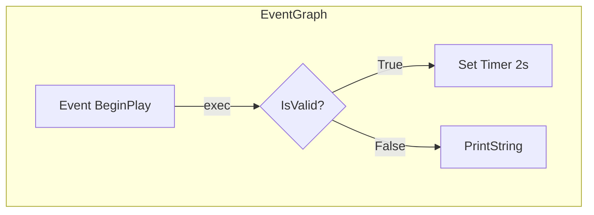

# 方案详解：蓝图图结构提取为 Agent 可读格式

## 一、问题定义

### 1.1 核心矛盾

蓝本是 **2D 有向图**（节点 + Pin + 连线），而 AI Agent 的推理链是 **1D 线性序列**（Token 流）。将图结构压入序列必然面临信息丢失或扭曲。

但这个矛盾并非无解——编译器早就解决了类似问题：将 AST（树结构）线性化为字节码（序列），关键在于**保留足够的信息使推理可以还原语义**。

### 1.2 信息层级

蓝图包含的信息可以分为四个层级：

| 层级 | 信息类型 | 示例 | Agent 是否必须理解 |
|------|---------|------|-------------------|
| L1 结构 | 节点类型、Pin 连接 | K2Node_Branch → then/else | 是 |
| L2 语义 | 节点标题、变量名、函数名 | "IsValid?", "PlayerRef" | 是 |
| L3 类型 | Pin 数据类型、默认值 | float, Actor*, 100.0 | 部分必须 |
| L4 布局 | 节点坐标、注释框、颜色 | NodePosX=240, NodePosY=-160 | 否（视觉信息） |

**L1-L3 必须零丢失，L4 可降采样。** 这是 JSON Schema 设计的边界条件。

---

## 二、UE Python API 能力与缺口分析

### 2.1 已暴露的 API（可用）

| 类/函数 | 能力 | 来源 |
|--------|------|------|
| `BlueprintEditorLibrary.find_graph()` | 按名称查找蓝图图 | BlueprintEditorLibrary 模块 |
| `BlueprintEditorLibrary.find_event_graph()` | 查找 EventGraph | 同上 |
| `BlueprintEditorLibrary.remove_unused_nodes()` | 移除未使用节点 | 同上 |
| `BlueprintEditorLibrary.rename_graph()` | 重命名图 | 同上 |
| `EditorAssetLibrary.load_asset()` | 加载蓝图资产 | EditorScripting 模块 |
| `EdGraphPinType` (StructBase) | Pin 类型描述 | Engine 模块 |
| `Blueprint` 类 | 蓝图元数据（category、parent class 等） | Engine 模块 |

### 2.2 未暴露的 API（缺口，核心）

| C++ 接口 | 作用 | Python 可访问性 |
|----------|------|----------------|
| `UEdGraph::Nodes` | 获取图的所有节点 | ❌ 未暴露 |
| `UEdGraphNode::Pins` | 获取节点的所有 Pin | ❌ 未暴露 |
| `UEdGraphPin::LinkedTo` | 获取 Pin 的连接目标 | ❌ 未暴露 |
| `UEdGraphPin::Direction` | Pin 方向（输入/输出） | ❌ 未暴露 |
| `UEdGraphPin` 类本身 | Pin 的完整表示 | ❌ 未暴露到 Python |
| `UK2Node::GetNodeTitle()` | 节点标题 | ❌ 未暴露 |
| `UK2Node` 子类名 | 节点语义类型 | ❌ 未暴露 |
| `UEdGraphNode::NodeComment` | 节点注释 | ❌ 未暴露 |
| `UEdGraphNode::NodePosX/Y` | 节点位置 | ❌ 未暴露 |

### 2.3 结论

Python API 只暴露了 **"管理型"操作**（创建、查找、编译、属性修改），而 **"读取型"操作**（遍历节点、读取连线）几乎完全缺失。

**必须通过 C++ 插件补充读取接口。**

---

## 三、C++ 插件设计：BlueprintGraphReader

### 3.1 设计原则

- **只读**：不修改任何蓝图数据，不产生副作用
- **最小接口**：只暴露提取所需的 6 个公开函数 + 内部序列化辅助函数
- **无外部依赖**：只依赖 Engine 和 BlueprintGraph 模块
- **Editor Only**：只在编辑器模式下编译和运行

### 3.2 公开接口

```cpp
UCLASS(meta=(ScriptName="BlueprintGraphReader"))
class BLUEPRINTGRAPHREADER_API UBlueprintGraphReader : public UBlueprintFunctionLibrary
{
    GENERATED_BODY()

public:
    // 一步提取整个蓝图为 JSON（推荐）
    UFUNCTION(BlueprintCallable, Category = "BlueprintGraph")
    static FString ExtractBlueprintAsJson(UBlueprint* Blueprint);

    // 获取蓝图的所有图名
    UFUNCTION(BlueprintCallable, Category = "BlueprintGraph")
    static TArray<FString> GetBlueprintGraphNames(UBlueprint* Blueprint);

    // 获取图中所有节点
    UFUNCTION(BlueprintCallable, Category = "BlueprintGraph")
    static TArray<UEdGraphNode*> GetGraphNodes(UEdGraph* Graph);

    // 获取节点语义信息（类名、标题、注释），返回 JSON
    UFUNCTION(BlueprintCallable, Category = "BlueprintGraph")
    static FString GetNodeSemanticInfo(UEdGraphNode* Node);

    // 获取节点的 Pin 列表信息，每个 Pin 为一条 JSON 字符串
    UFUNCTION(BlueprintCallable, Category = "BlueprintGraph")
    static TArray<FString> GetNodePinInfo(UEdGraphNode* Node);

    // 获取蓝图变量列表，每个变量为一条 JSON 字符串
    UFUNCTION(BlueprintCallable, Category = "BlueprintGraph")
    static TArray<FString> GetBlueprintVariables(UBlueprint* Blueprint);

private:
    static TSharedPtr<FJsonObject> SerializeGraph(UEdGraph*, int32& NodeIdCounter, int32& PinIdCounter);
    static TSharedPtr<FJsonObject> SerializeNode(UEdGraphNode*, const FString& NodeId, const TMap<UEdGraphPin*, FString>& PinIdMap);
    static TSharedPtr<FJsonObject> SerializePin(UEdGraphPin*, const FString& PinId);
    static void ExtractEdges(UEdGraph*, const TMap<UEdGraphPin*, FString>& PinIdMap, TArray<TSharedPtr<FJsonValue>>& EdgesArray);
    static FString NormalizeNodeClassName(UClass* NodeClass);
    static bool IsExecPin(UEdGraphPin* Pin);
    static FString GetPinTypeString(UEdGraphPin* Pin);
    static FString GetPinTypeStringFromCategory(const FName& Category);
    static constexpr int32 MaxTitleLength = 256;
};
```

### 3.3 ExtractBlueprintAsJson 实现策略

```cpp
FString UBlueprintGraphReader::ExtractBlueprintAsJson(UBlueprint* Blueprint)
{
    if (!Blueprint) return "{}";

    TSharedPtr<FJsonObject> RootJson = MakeShared<FJsonObject>();

    // 1. 蓝图元数据
    RootJson->SetStringField("schema_version", "v1");
    RootJson->SetStringField("asset_path", Blueprint->GetPathName());
    RootJson->SetStringField("blueprint_type",
        StaticEnum<EBPType>()->GetNameStringByValue(...));

    // parent_class — 始终输出，无父类时为 null
    if (Blueprint->ParentClass)
        RootJson->SetStringField("parent_class", Blueprint->ParentClass->GetName());
    else
        RootJson->SetField("parent_class", MakeShared<FJsonValueNull>());

    // 2. 变量（name, type, default_value, instance_editable, expose_on_spawn）

    // 3. 遍历所有图（共享 NodeIdCounter/PinIdCounter 保证 ID 全局唯一）
    for (UbergraphPages)    → graph_type = "ubergraph"
    for (FunctionGraphs)    → graph_type = "function" | "construction_script"
    for (DelegateSignature) → graph_type = "delegate_signature"

    // 4. 宏图（单独存放）
    for (MacroGraphs) → macro_graphs[], graph_type = "macro"

    // 5. SCS 组件树
    for (SimpleConstructionScript->GetAllNodes()) → components[]

    // 6. Timeline 模板
    for (Timelines) → timelines[] (name, loop, length)

    // 7. 实现的接口
    for (ImplementedInterfaces) → interfaces[] (name, graph_count)

    // 序列化
    FString Output;
    TSharedRef<TJsonWriter<>> Writer = TJsonWriterFactory<>::Create(&Output);
    FJsonSerializer::Serialize(RootJson.ToSharedRef(), Writer);
    return Output;
}
```

### 3.4 序列化细节

**Pin ID 方案**：纯序号制（p0, p1, p2...），在单次 `ExtractBlueprintAsJson` 调用内全局唯一。每个图共享 `PinIdCounter`，保证跨图 ID 不冲突。

**Hidden Pin 处理**：Hidden pin（如 self pin）仍加入 `PinIdMap` 以便 edge 提取时解析 `LinkedTo` 指针，但 `SerializePin` 阶段跳过，保持 JSON 精简。

**边去重**：使用 `TSet<TPair<UEdGraphPin*, UEdGraphPin*>>` 做指针级去重，而非字符串拼接，避免 ID 碰撞。

**类名标准化**：`NormalizeNodeClassName` 移除 U 前缀（双大写模式如 UK2Node → K2Node）和 _C 后缀。

**Pin 类型映射**：`GetPinTypeStringFromCategory` 使用 `UEdGraphSchema_K2` 常量（如 `PC_Exec`、`PC_Boolean`）替代硬编码字符串，另含 vector/rotator/transform/enum/map/set 的字符串降级匹配。

**标题截断**：`MaxTitleLength = 256`，超过时截断加 `...`。

---

## 四、JSON Schema 设计

### 4.1 完整 Schema（与 C++ 输出对齐）

```json
{
  "schema_version": "v1",
  "asset_path": "/Game/Blueprints/BP_Enemy",
  "blueprint_type": "BPType_Normal",
  "parent_class": "Actor",
  "variables": [
    {
      "name": "Health",
      "type": "float",
      "default_value": "100.0",
      "instance_editable": true,
      "expose_on_spawn": false
    }
  ],
  "graphs": [
    {
      "name": "EventGraph",
      "graph_type": "ubergraph",
      "nodes": [
        {
          "id": "n0",
          "class": "K2Node_Event",
          "title": "Event BeginPlay",
          "comment": "",
          "position": [100, 200],
          "pins": [
            {
              "id": "p0",
              "name": "",
              "direction": "output",
              "pin_type": "exec",
              "default_value": "",
              "is_exec": true
            },
            {
              "id": "p1",
              "name": "self",
              "direction": "output",
              "pin_type": "object",
              "sub_type": "Actor",
              "default_value": "",
              "is_exec": false
            }
          ]
        },
        {
          "id": "n1",
          "class": "K2Node_IfThenElse",
          "title": "IsValid?",
          "comment": "",
          "position": [400, 200],
          "pins": [
            {
              "id": "p4",
              "name": "",
              "direction": "input",
              "pin_type": "exec",
              "default_value": "",
              "is_exec": true
            },
            {
              "id": "p5",
              "name": "Condition",
              "direction": "input",
              "pin_type": "bool",
              "default_value": "false",
              "is_exec": false
            },
            {
              "id": "p6",
              "name": "True",
              "direction": "output",
              "pin_type": "exec",
              "default_value": "",
              "is_exec": true
            },
            {
              "id": "p7",
              "name": "False",
              "direction": "output",
              "pin_type": "exec",
              "default_value": "",
              "is_exec": true
            }
          ]
        }
      ],
      "edges": [
        { "from_pin": "p0", "to_pin": "p4", "edge_type": "exec" },
        { "from_pin": "p1", "to_pin": "p8", "edge_type": "data" }
      ]
    }
  ],
  "macro_graphs": [],
  "components": [
    { "class": "StaticMeshComponent", "name": "Mesh", "template_name": "Mesh", "child_index": 0 }
  ],
  "timelines": [
    { "name": "Timeline_0", "loop": false, "length": 5.0 }
  ],
  "interfaces": [
    { "name": "IInteractable", "graph_count": 1 }
  ]
}
```

### 4.2 设计决策

**1. Pin 级建模（而非 Node 级）**

蓝图的执行语义由 Pin 连接决定：
- **exec pin** (白色三角形) = 控制流
- **data pin** (彩色圆点) = 数据流

如果只建模 node→node 边，就丢失了"这个连接是控制流还是数据流"的关键信息。

**2. 保留 node.class（K2Node 子类名）**

这是 Agent 理解节点语义的最可靠信号：

| node.class | Agent 理解 |
|-----------|-----------|
| `K2Node_Event` | 事件入口（执行起点） |
| `K2Node_FunctionEntry` | 函数入口 |
| `K2Node_CallFunction` | 调用某个函数 |
| `K2Node_VariableGet` | 读取变量 |
| `K2Node_VariableSet` | 写入变量 |
| `K2Node_IfThenElse` | 条件分支 |
| `K2Node_ForEachLoop` | 遍历循环 |
| `K2Node_MacroInstance` | 宏实例 |
| `K2Node_Switch*` | Switch 分支 |
| `K2Node_CustomEvent` | 自定义事件 |
| `K2Node_CallParentFunction` | 调用父类函数 |
| `K2Node_SpawnActorFromClass` | 生成 Actor |
| `K2Node_DynamicCast` | 动态类型转换 |
| `K2Node_MakeStruct` | 构造结构体 |
| `K2Node_BreakStruct` | 解构结构体 |
| `K2Node_Timeline` | Timeline |
| `K2Node_ExecutionSequence` | Sequence |
| `K2Node_BaseAsyncTask` | 异步任务 |
| `K2Node_AsyncAction` | 异步 Action |
| `K2Node_Knot` | Reroute 透传 |
| `K2Node_ReturnNode` | 返回节点 |

`node.title` 是给人看的（可能是中文、可能重载），`node.class` 是给 Agent 看的（确定性语义）。

**3. edge_type 区分控制流和数据流**

```json
{"edge_type": "exec"}   // 控制流：决定执行顺序
{"edge_type": "data"}   // 数据流：决定数据传递
```

Agent 追踪控制流时只需沿 exec 边遍历，追踪数据依赖时沿 data 边回溯。

**4. is_exec 布尔标记**

Pin 级 `is_exec: true/false` 提供冗余但明确的 exec 标记，下游无需从 `pin_type` 推断。

**5. 变量声明与引用分离**

变量在 `variables` 数组中声明，在 `K2Node_VariableGet/Set` 节点中通过 Pin 引用。Agent 需要同时看到两处。

**6. 组件树 / Timeline / 接口作为顶层字段**

这些不属于图结构，但属于蓝图完整信息。单独存放（`components`、`timelines`、`interfaces`）保持 `graphs[]` 语义纯净。

---

## 五、下游转换：从 JSON 到 Agent 可读

### 5.1 JSON → 伪代码（核心，纯算法，不依赖 LLM）

```python
def graph_to_pseudocode(graph_data: dict) -> str:
    """
    沿 exec pin 做 DFS 遍历，将图结构线性化为缩进伪代码。
    Agent 可以像读代码一样推理蓝图逻辑。
    支持 22 种 K2Node 子类的专用处理器。
    """
```

输出示例：

```
blueprint /Game/Blueprints/BP_Enemy
  parent: Actor

variables:
  float Health = 100.0 [editable]
  Actor PlayerRef

graph EventGraph (ubergraph):

  Event BeginPlay:
    if IsValid(PlayerRef):
      SetTimer(duration=2.0, delegate=SpawnEnemy)
      InitializeHUD()
    else:
      PrintString("Player not found")

  Event SpawnEnemy:
    SpawnActor(...)
    Health = 100.0
    PrintString("Enemy spawned!")

function TakeDamage(Amount: float):
  Health = Health - Amount
  if Health <= 0:
    Die()
  else:
    PlayHitEffect()
```

**关键算法细节**：
- 每个入口节点独立 `visited` 集合（同一节点可出现在不同入口路径中）
- DFS 深度限制 `MAX_DFS_DEPTH = 50`，超限停止递归
- `resolve_data_input()`：沿 data pin 反向查找输入值来源
- 分支节点（if/switch/cast）的每个分支独立 visited，避免丢失
- `K2Node_MacroInstance` 自动识别 ForEachLoop 宏，复用循环逻辑
- `K2Node_Knot`（Reroute）透传，不输出

### 5.2 JSON → Mermaid（给人看的可视化）

```python
def graph_to_mermaid(graph_data: dict, pin_name_map=None) -> str:
    """导出为 Mermaid flowchart，exec 边实线，data 边虚线"""
```

输出示例：



### 5.3 JSON → graphify 知识图谱（给 Agent 查询）

```python
def graph_to_graphify(graph_data: dict) -> dict:
    """转换为 graphify 的节点-边格式，接入知识图谱查询"""
```

转换规则：
- 蓝图本身 → graphify node（type=blueprint）
- 蓝图节点 → graphify node（带 class、title 属性）
- Pin 连接 → graphify edge（带 edge_type 标签）
- 变量 → graphify node（type=variable）
- Pin-to-Node 映射通过 `pin_to_node` dict 安全查找

### 5.4 LLM 语义增强（可选，Phase 5 未实现）

对复杂子图（如状态机、行为树交互），用 LLM 生成自然语言注释。

---

## 六、替代方案对比

| 方案 | 信息完整度 | 部署门槛 | 维护成本 | Agent 推理效率 |
|------|-----------|---------|---------|---------------|
| **A. C++ 插件 + JSON** | ★★★★★ 零丢失 | ★★★ 需编译插件 | ★★★★ 接口稳定 | ★★★★ JSON→伪代码高效 |
| B. 解析 .uasset 二进制 | ★★★★ 跳过 L4 布局 | ★★ 需维护反序列化 | ★★ 格式随版本变 | ★★★ 同上 |
| C. Python 反射 hack | ★★ 不稳定 | ★★★★ 零部署 | ★ 随时可能失效 | ★★★★ 同上 |
| D. 截图 + 视觉模型 | ★ 严重丢失 | ★★★★ 零部署 | ★★★ 模型依赖 | ★ 极低 |
| E. 只导出 Copied Text | ★★ 丢失拓扑 | ★★★★ UE 内置 | ★★★★ 零维护 | ★★ 缺少连接信息 |

**推荐方案 A**：信息完整度最高，C++ 插件是一次投入、长期受益的基础设施。

---

## 七、与 unreal-python-stubhub 的关系

Blueprint Graph Reader 是 unreal-python-stubhub 的**互补项目**：

```
unreal-python-stubhub          Blueprint Graph Reader
     │                              │
     │  Python API 存根             │  蓝图图结构
     │  (15,435 个类/函数)          │  (节点/Pin/连线)
     │                              │
     └──────────┬───────────────────┘
                │
                ▼
          graphify 知识图谱
                │
                ▼
          Agent 可查询、可推理的 UE 知识网络
```

- stubhub 回答"有什么 API 可以用"
- Graph Reader 回答"蓝图逻辑是怎么组织的"
- 两者通过 graphify 统一查询，Agent 可以从 API 定义跳转到蓝图用法
